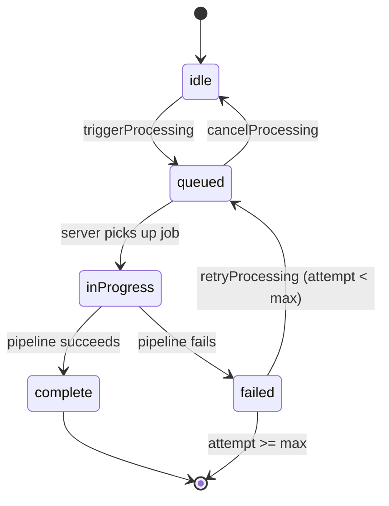

# BE-HANDOFF — {Feature Area}

> **Canonical contract:** `contracts/{feature-area}.ts`
> This document is the human-readable companion. It explains the contract for Notion review and onboarding. The `.ts` file is what compiles and what AI agents read as source of truth.

## Summary

One paragraph: what surface BE is exposing to FE for this feature area, and the state machine that governs it. Name the feature in user-facing terms, not technical ones.

## Mutations (what FE calls)

### `triggerProcessing(entityIds)`

**Purpose:** Start processing for the given entities.

**Call semantics:** Returns when BE has accepted the request (not when processing completes). If BE cannot accept the request — e.g. quota exceeded — the returned promise rejects. Everything else surfaces through status.

**Pre-conditions:** {entity must exist, must be in 'idle' state, etc.}

**Post-conditions:** Each entity transitions to `queued` (online) or `queued` with `offline: true` (offline). FE should expect the status change to be observable before the promise resolves.

**Error cases:**
- `quotaExceeded` → promise rejects, status unchanged
- `invalidInput` (e.g. empty array) → promise rejects synchronously
- Network error while online → promise resolves anyway; items are queued locally and will submit on reconnect

### `retryProcessing(entityId)`
{...}

### `cancelProcessing(entityId)`
{...}

## Selectors (what FE reads)

### `useEntityStatus(entityId): EntityStatus`

Returns the current state for one entity. Re-renders on every transition.

**State machine:**

**Presentation guidance:**
- `idle` — no UI needed
- `queued` with `offline: true` — show "Will process when online" chip
- `inProgress` — show spinner, use `progress` if defined for a determinate bar
- `complete` — transition to Library within ~500ms
- `failed` — show error with retry button if `retriable`

### `useQueueStats()`
{...}

### `useOnlineStatus()`
{...}

## Events (optional subscriptions)

### `'processing.completed'`
Fires once per entity that transitions to `complete`. Use for toast notifications, navigation, or analytics. Do not use this for render-driving state — use `useEntityStatus` for that.

### `'processing.failed'`
{...}

## Implementation notes for BE

(This section is for BE team's reference, not part of the contract FE depends on.)

- Internal state machine has additional stages (uploading, transcribing, structuring) that collapse to `inProgress` at the contract surface. This is deliberate — FE should not distinguish them.
- Retry backoff: exponential with jitter, max 3 attempts; `nextRetryAt` in the `failed` variant tells FE when the next attempt is scheduled.
- `offline: true` is set by comparing against `navigator.onLine` at queue time, not by testing the network.

## Amendment policy

Changes to the canonical `.ts` file require a co-reviewed PR with sign-off from both FE and BE leads. If you're considering a change mid-implementation:

1. Flag it to both leads.
2. Propose the change as a diff to the `.ts` file.
3. Update this document in the same PR.
4. Do not merge the implementation change until the contract PR lands.

If this feels slow, that's the point — contract churn during implementation is the single most expensive failure mode of parallel-team development.

## Contract history

| Date | Change | Reason |
|---|---|---|
| YYYY-MM-DD | Initial draft | Spec {X.Y} |
